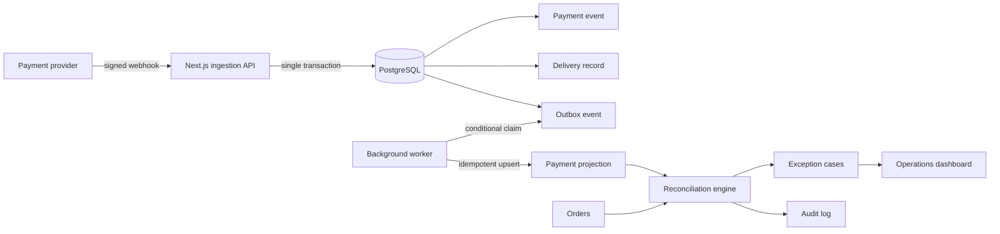
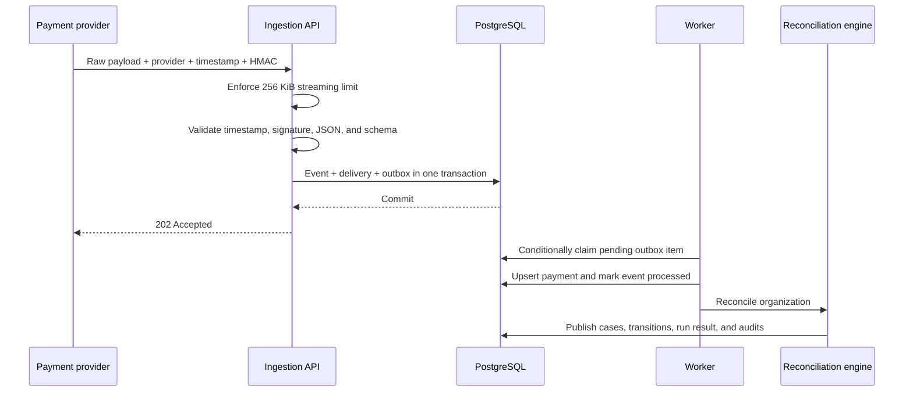
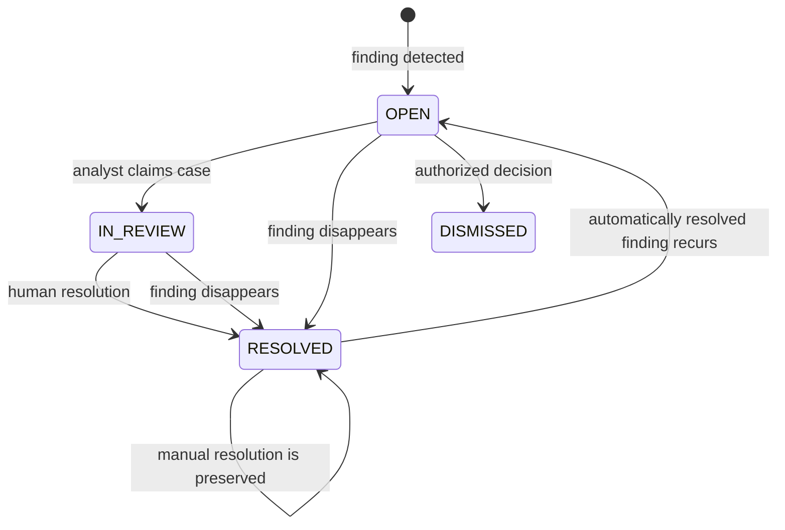

# ConciliaCore

**A payment reconciliation platform built around reliable ingestion, deterministic rules, exception management, and operational traceability.**

ConciliaCore receives signed payment webhooks, persists each accepted event together with a transactional outbox entry, and processes it asynchronously. The reconciliation engine compares the resulting payment projection against orders. Any mismatch becomes an operational case with evidence, ownership, resolution history, and an audit trail.

The project is intentionally implemented as a modular monolith with a separate worker process. It demonstrates production-oriented engineering decisions without introducing distributed-system complexity that the current scale does not require.

The interface defaults to Brazilian Portuguese and can be switched to English from the header. The preference is stored in a cookie and drives server-rendered metadata, the document language, client copy, currency, dates, and relative time.


## Table of contents

- [What the system solves](#what-the-system-solves)
- [Product walkthrough](#product-walkthrough)
- [Architecture](#architecture)
- [Reliability guarantees](#reliability-guarantees)
- [Reconciliation rules](#reconciliation-rules)
- [Case lifecycle](#case-lifecycle)
- [Authorization model](#authorization-model)
- [Technology stack](#technology-stack)
- [Run locally](#run-locally)
- [Testing strategy](#testing-strategy)
- [Security model](#security-model)
- [Known boundaries](#known-boundaries)
- [Repository structure](#repository-structure)

## What the system solves

Payment providers and order systems do not always agree. A webhook may arrive more than once, a payment can reference an unknown order, an order can retain the wrong status, or the paid amount can differ from the expected amount.

ConciliaCore turns those inconsistencies into an explicit workflow:

1. Authenticate and validate the raw webhook request.
2. Persist the event before acknowledging receipt.
3. Publish work through a transactional outbox.
4. Materialize an idempotent local payment projection.
5. Run deterministic reconciliation rules.
6. Open, update, automatically close, or reopen exception cases.
7. Preserve the evidence and actor behind every operational decision.

This separation keeps transport reliability, business rules, and human investigation independently testable.

## Product walkthrough

### 1. Controlled demo access

The seeded environment includes administrator, analyst, and read-only auditor profiles. Authentication uses a signed session cookie, while role and organization membership are reloaded from the database for every validated session.

The sign-in screen below shows the default Brazilian Portuguese experience. The same interface can be switched to English before authentication or from the authenticated header.


### 2. Operational overview and reliability

The dashboard summarizes processed volume, reconciliation rate, open exceptions, webhook delivery health, provider distribution, and recent activity. Its reliability view exposes delivery outcomes, duplicate handling, provider distribution, and the idempotency contract instead of hiding those concerns behind aggregate numbers.


### 3. Engineering guarantees made visible

The product includes an engineering view that connects each behavior to its implementation evidence. It covers webhook verification, database constraints, outbox recovery, tenant scoping, deterministic decisions, and known limits.


### 4. Human exception management

Each case exposes the triggered rule, related order and payment, monetary difference, structured evidence, current owner, lifecycle state, and resolution form. Administrators and analysts may claim and resolve cases; auditors remain read-only.


### 5. Operational audit trail

Authentication events, reconciliation runs, duplicate deliveries, case assignments, case resolutions, automatic transitions, and payment processing are recorded with actor, timestamp, entity, summary, and safe operational metadata.


## Architecture



### Webhook ingestion sequence



The acknowledgement is sent only after the ingestion transaction commits. A successful `202` means the event was durably accepted for asynchronous processing; it does not claim that reconciliation has already completed.

## Reliability guarantees

| Concern | Implemented behavior | Evidence |
| --- | --- | --- |
| Request authenticity | HMAC-SHA256 covers `timestamp.provider.rawBody` and uses constant-time comparison | `src/lib/crypto.ts` |
| Replay window | Signed timestamps must be within a five-minute tolerance | webhook route |
| Payload protection | The body is rejected while streaming once it exceeds 256 KiB | webhook route |
| Schema integrity | Zod validates the external event before persistence | webhook route |
| Secret storage | Webhook secrets use AES-256-GCM with a random IV | `src/lib/crypto.ts` |
| Ingestion atomicity | Payment event, accepted delivery, and outbox message commit together | webhook route |
| Ingestion idempotency | `organization + provider + external event ID` is unique | Prisma schema |
| Materialization idempotency | Payment transactions are upserted by provider identity | worker/outbox service |
| Worker concurrency | A conditional state update allows only one worker to claim a candidate | `src/lib/outbox.ts` |
| Retry policy | Bounded exponential backoff with jitter and stale-lock recovery | `src/lib/outbox.ts` |
| Monetary precision | Business rules compare integer cents, never floating-point currency | reconciliation domain |
| Case identity | A deterministic fingerprint is unique within each organization | reconciliation domain and schema |
| Result publication | Case updates, lifecycle transitions, run completion, and audits share a serializable transaction | reconciliation service |
| Transaction conflicts | Serializable conflicts are retried up to three times with explicit timeouts | reconciliation service |
| Tenant isolation | Authenticated queries derive `organizationId` from the server-side session | API routes |

The delivery model is **at least once with idempotent effects**. The project does not present itself as an exactly-once system.

## Reconciliation rules

The engine is a pure domain function. Given the same orders and payments, it produces the same findings and fingerprints.

| Finding | Trigger | Default severity |
| --- | --- | --- |
| `UNMATCHED_PAYMENT` | A payment cannot be associated with an order | High |
| `AMOUNT_MISMATCH` | Payment and order amounts differ | High or critical |
| `DUPLICATE_PAYMENT` | More than one confirmed payment targets the same order | High or critical |
| `ORDER_STATUS_MISMATCH` | A confirmed payment is not reflected in the order status | Medium or critical |
| `REFUND_MISMATCH` | A refunded payment is not reflected in the order | High |
| `MISSING_PAYMENT` | An order marked as paid has no confirmed transaction | High |

Rule evaluation is isolated from transport and persistence concerns in [`src/domain/reconciliation.ts`](./src/domain/reconciliation.ts).

## Case lifecycle



Automatic and manual resolutions are deliberately different:

- When an active finding disappears, the system closes it with an `AUTOMATIC` resolution source.
- If that fingerprint appears again, an automatically closed case is reopened.
- A manually resolved case remains resolved if the same fingerprint recurs.
- Reopenings and automatic closures produce dedicated audit events.

The integration test executes this complete lifecycle against a real PostgreSQL database.

## Authorization model

| Capability | Administrator | Analyst | Auditor |
| --- | :---: | :---: | :---: |
| View operational data | Yes | Yes | Yes |
| View audit evidence | Yes | Yes | Yes |
| Run reconciliation | Yes | Yes | No |
| Emit demo incidents | Yes | Yes | No |
| Assign and update cases | Yes | Yes | No |
| Resolve cases | Yes | Yes | No |
| Restore seeded demo data | Yes | No | No |

The UI hides unavailable actions for clarity, but authorization is enforced again on the server. The organization is never accepted from a mutation body; it is derived from the authenticated user.

## Technology stack

| Layer | Technology | Responsibility |
| --- | --- | --- |
| Web application | Next.js 16, React 19, TypeScript | App Router UI and route handlers |
| Persistence | PostgreSQL 17, Prisma 6 | Relational model, migrations, transactions, constraints |
| Background processing | Dedicated Node.js worker | Outbox consumption, retries, payment materialization |
| Validation and security | Zod, `jose`, bcrypt, Node crypto | Contracts, sessions, password hashing, HMAC, AES-GCM |
| Unit and domain tests | Vitest | Pure rules, authorization, crypto, route behavior |
| Integration tests | Vitest + PostgreSQL | Transactional case lifecycle with the real database |
| End-to-end tests | Playwright | Authentication, validation contracts, reconciliation workflow, RBAC, mobile navigation |
| Delivery | Docker Compose, GitHub Actions | Reproducible local environment and CI pipeline |

## Run locally

### Requirements

- Node.js 24 or newer
- Docker Desktop or a compatible Docker Engine

### Complete environment with Docker

```bash
docker compose up --build
```

This starts PostgreSQL, applies migrations, seeds synthetic data, and launches both the web application and the worker. Open [http://localhost:3000](http://localhost:3000).

### Manual development setup

```bash
npm ci
cp .env.example .env
npm run db:migrate
npm run db:seed
npm run dev
```

Start the worker in a second terminal:

```bash
npm run worker
```

### Demo accounts

| Role | Email | Password |
| --- | --- | --- |
| Administrator | `admin@conciliacore.dev` | `Demo@123` |
| Analyst | `analyst@conciliacore.dev` | `Demo@123` |
| Read-only auditor | `auditor@conciliacore.dev` | `Demo@123` |

> These credentials and all seeded business data are synthetic. They are provided only for local evaluation and must never be reused in a real environment.

### Emit signed webhook examples

With the application and worker running:

```bash
npm run demo:emit
```

The script signs each request with the same canonical input used by the server and sends representative payment events to the local endpoint.

## Testing strategy

```bash
npm run lint             # ESLint across application, tests, scripts, and config
npm run typecheck        # TypeScript without emitting files
npm test                 # 27 unit and route-level tests
npm run test:integration # PostgreSQL-backed reconciliation lifecycle
npm run test:e2e         # 4 browser/API journeys
npm run build            # Optimized Next.js production build
```

The current suite covers:

- deterministic reconciliation findings and fingerprints;
- money parsing and integer-cent arithmetic;
- role-based permissions;
- session and authentication behavior;
- HMAC signing and verification;
- webhook rejection, deduplication, and safe failure handling;
- automatic closure, recurrence reopening, and manual-resolution preservation;
- desktop and mobile operational journeys;
- read-only auditor enforcement through the API.

GitHub Actions runs static checks and unit tests first, then provisions PostgreSQL for migrations, seed validation, the integration test, and Playwright journeys.

## Security model

The public webhook endpoint is treated as the primary untrusted boundary. Before a payload reaches persistence, the route validates its byte size, organization, encrypted secret configuration, signed timestamp, provider-bound HMAC, JSON syntax, and schema.

Authenticated routes use an `HttpOnly`, `SameSite=Lax` session cookie with an eight-hour lifetime. The token stores only the user ID; current role and organization membership are read from PostgreSQL when the session is validated.

Global response headers deny framing, disable MIME sniffing, limit referrer disclosure, and turn off unused camera, microphone, and geolocation capabilities. Operational logs intentionally avoid raw financial payloads and credentials. See the complete [threat model](./docs/security.md) and [API contract](./docs/api.md).

## Known boundaries

The repository documents limits as explicitly as implemented guarantees:

- Delivery is at least once; downstream effects rely on idempotency.
- Timestamp validation narrows replay exposure, but the system does not persist provider nonces.
- Tenant isolation is enforced by application queries; PostgreSQL Row-Level Security is not enabled yet.
- Worker claims use a time-based lease without an owner token or heartbeat.
- Audit records are useful operational evidence, but they are not tamper-proof or stored in WORM storage.
- `dataRetentionDays` is modeled, but an automated purge job is not implemented.
- Rate limiting, MFA, password recovery, KMS-backed key rotation, and a production WAF remain deployment work.
- Demo-only mutation routes must be disabled or removed before a real deployment.

These constraints are not hidden behind architecture language. They define the next hardening steps in [`docs/architecture.md`](./docs/architecture.md) and [`docs/security.md`](./docs/security.md).

## Repository structure

```text
src/
  app/                  Next.js pages and API route handlers
    styles/             Ordered base and product-theme CSS slices
  components/           Application shells and shared UI
    dashboard/          Focused operational views, helpers, and types
  contracts/            Shared serializable boundary types
  domain/               Pure permissions and reconciliation rules
  lib/                  Auth, crypto, outbox, persistence, and services
  worker.ts             Background outbox consumer
prisma/
  migrations/           Versioned PostgreSQL migrations
  schema.prisma         Data model and database constraints
  seed.ts               Synthetic evaluation environment
tests/
  integration/          Real PostgreSQL lifecycle coverage
e2e/                    Browser and API journeys
docs/                   Architecture, API, and security documentation
.github/workflows/       Continuous integration pipeline
```

## Additional documentation

- [Architecture and transaction boundaries](./docs/architecture.md)
- [HTTP API and webhook contract](./docs/api.md)
- [Threat model and residual risks](./docs/security.md)
- [Contribution guidelines](./CONTRIBUTING.md)
- [Security reporting policy](./SECURITY.md)

## License

Distributed under the [MIT License](./LICENSE).
