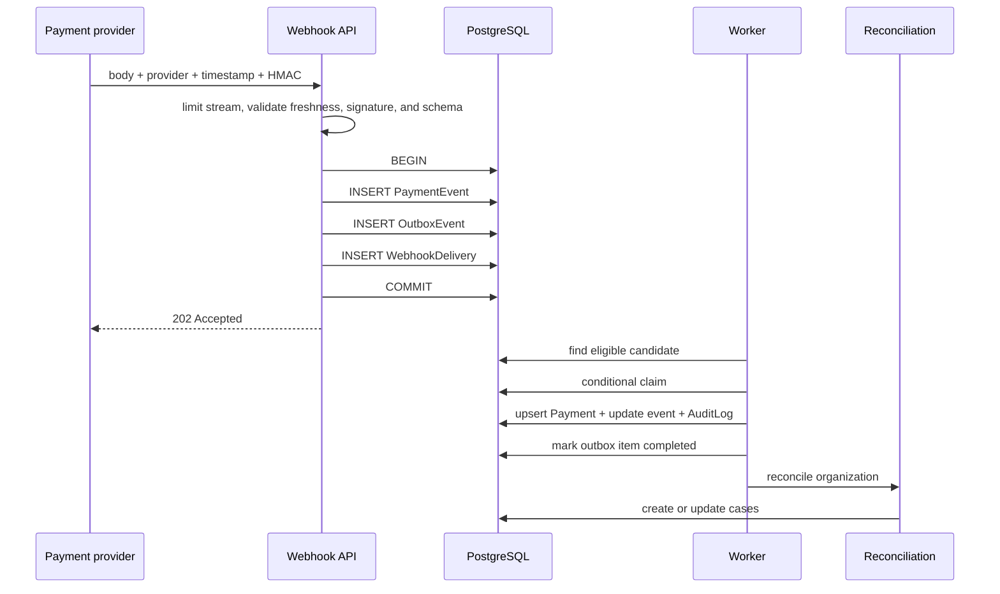

# Architecture

This document describes behavior that exists in the code. When a guarantee ends at a specific boundary, that boundary is stated explicitly instead of being hidden behind an abstraction.

## Context

ConciliaCore receives payment events, maintains a local transaction projection, and compares that projection against orders. Mismatches become cases that a person can claim, investigate, and resolve.

The system has four primary runtime units:

- web application and API;
- PostgreSQL as the source of truth;
- outbox worker;
- deterministic reconciliation engine.

The web application and worker share the same schema and domain code, but they run as independent processes.

## Ingestion sequence



### What the ingestion transaction guarantees

`PaymentEvent`, `OutboxEvent`, and the accepted delivery record are persisted together. If any insert fails, the API does not acknowledge receipt.

The external event identity is protected by:

```text
UNIQUE (organizationId, provider, providerEventId)
```

A violation of this constraint is recognized as a duplicate and receives `200` without creating a second event.

## Outbox processing

The worker looks for the oldest eligible record whose `nextAttemptAt` has elapsed. The claim uses `updateMany` with the same state predicate that selected the record. Two workers may observe the same candidate, but only one can move it to `PROCESSING`.

The materialized payment protects the effect again:

```text
UNIQUE (organizationId, provider, transactionId)
```

Payment materialization, the `PaymentEvent` state transition, and the corresponding `AuditLog` use the same transaction. A retry either finds an event already marked as processed or upserts the same payment identity.

### Retry policy

- maximum of 5 attempts;
- exponential delay of `2^attempt × 5s`;
- jitter between 0 and 3 seconds;
- delay capped at 300 seconds;
- lock considered abandoned after 5 minutes.

The claim does not have an owner identifier or heartbeat. Work that exceeds the lock timeout may be reclaimed by another worker, so every effect must remain idempotent.

## Reconciliation engine

`src/domain/reconciliation.ts` is a pure function. It receives orders and payments and returns findings with a fingerprint, severity, and structured evidence.

| Type | Summarized condition |
| --- | --- |
| `UNMATCHED_PAYMENT` | payment has no corresponding order |
| `AMOUNT_MISMATCH` | order and payment amounts differ |
| `DUPLICATE_PAYMENT` | more than one confirmed payment targets an order |
| `ORDER_STATUS_MISMATCH` | confirmation is not reflected in the order state |
| `REFUND_MISMATCH` | refund is not reflected in the order |
| `MISSING_PAYMENT` | paid order has no confirmed transaction |

The fingerprint is deterministic for the current input set, and a unique constraint applies within each organization. Running reconciliation again updates the existing case instead of creating a copy.

When a finding disappears, an active case is closed with an `AUTOMATIC` resolution source. If the same fingerprint recurs, only an automatically resolved case is reopened; a human decision marked `MANUAL` is preserved. Reopenings and automatic closures create dedicated audit events.

## Multi-tenancy

Every operational entity carries an `organizationId`. Authenticated routes derive this value from the server-side session and include it in query filters.

This is application-level isolation, not database-level isolation. Row-Level Security and composite foreign keys do not yet force every relationship to remain within one organization. The current model reduces prototype complexity but leaves an important defense-in-depth layer for future work.

## Session and authorization

The session token contains only `userId`, expires after 8 hours, and is stored in an `HttpOnly`, `SameSite=Lax` cookie. The `Secure` flag is enabled when the public application URL uses HTTPS.

For every valid session read, the user, role, and organization are loaded from the database. Permissions are centralized in small domain functions:

- `ADMIN`: restores the demo environment and manages cases;
- `ANALYST`: manages and resolves cases;
- `AUDITOR`: read-only access.

## Transaction boundaries

| Operation | Atomic data |
| --- | --- |
| Accepted ingestion | `PaymentEvent` + `OutboxEvent` + `WebhookDelivery` |
| Materialization | `Payment` + event state + `AuditLog` |
| Human resolution | case state/resolution + `AuditLog` |
| Reconciliation publication | created/updated cases + automatic transitions + per-case audits + completed run |

The whole pipeline is not one distributed transaction. In particular, an outbox item is marked as completed before reconciliation is called. A normal reconciliation exception returns the item to the retry path, but an abrupt interruption exactly between those steps can leave the projection current and the cases stale until the next manual run or payment event.

Within the reconciliation service, publishing a result uses a serializable transaction: upserts, reopenings, automatic closures, audits, and run completion commit or roll back together. Serializable conflicts receive up to three short retries, and the transaction has explicit wait and execution timeouts. Initial run creation and failure marking remain outside that transaction so an aborted attempt stays observable.

## Why this is not a microservice system

The domain still fits in one web process and one consumer. Separating authentication, ingestion, reconciliation, and cases into different services would add network contracts, distributed tracing, and more consistency strategies before an operational need exists.

The current split preserves one real boundary—asynchronous processing—while keeping the remaining boundaries as modules. If throughput or team ownership later justifies extraction, the outbox and explicit contracts provide a migration point.

## Next hardening steps

1. sign and persist a nonce for providers that supply delivery identities;
2. add owner, lease, and heartbeat semantics to worker claims;
3. trigger reconciliation through a second recoverable stage;
4. add Row-Level Security and cross-organization isolation tests;
5. version reconciliation rules and fingerprints;
6. add metrics, traces, and alerts for queue depth, retries, and cases;
7. implement retention and verifiable deletion jobs.
